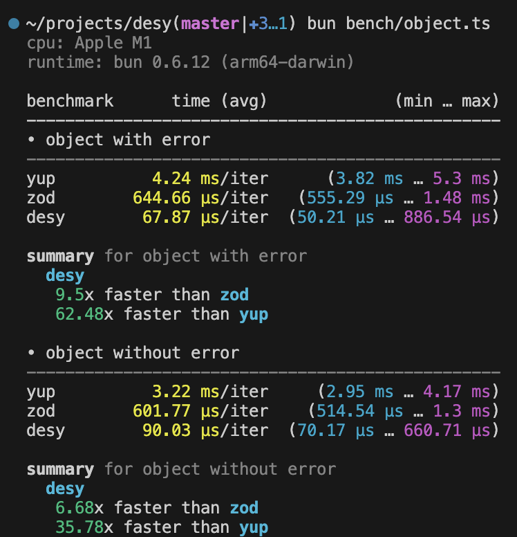

# desy - Dead Extraordinary Simple Yup

## key ideas

- be `simple`
- be as `fast` as point 1 allows

## key features

- Stop validating on the first error. Desy stops validating on the first error and returns it.
- A string is an indicator. Desy returns an empty string in a valid case. In case of an error, Desy returns a string with a description of the error.
- No throwing errors. Desy only returns an empty or non-empty string.

## install

```sh
npm install desy
```

## Basic usage

Creating a simple string schema

```ts
import {d} from 'desy';

// creating a schema for strings
const mySchema = d.string();

// validating
mySchema.validate('tuna'); // => ""
mySchema.validate(12); // => "Value must be string"
```

Creating an object schema

```ts
import {d, InferDesy} from 'desy';

const userSchema = d.object({
  username: d.string(),
});

const error = userSchema.validate({username: 'Ludwig'}); // error is ""

// extract the inferred type
type User = InferDesy<typeof user>;
// { username: string }
```

## Realworld Example

```ts
const schema = d.array(
  d.object({
    type: d.string().oneOf(['person']),
    hair: d.string().oneOf(['blue', 'brown']),
    active: d.boolean(),
    name: d.string(),
    age: d.number().int(),
    hobbies: d.array(d.string()),
    address: d.object({
      street: d.string(),
      zip: d.string(),
      country: d.string(),
    }),
  }),
);
schema.validate(people);
```

## API

- [mixed()](#mixed)
- [string()](#string)
- [number()](#number)
- [number()](#number)
- [boolean()](#boolean)
- [date()](#date)
- [null()](#null)
- [object()](#object)
- [array()](#array)

### mixed

- `mixed()`

```ts
const schema = d.mixed();

schema('a'); // valid
schema(''); // valid
schema(null); // valid
```

### string

- `.string()`

```ts
const schema = d.string();

schema('a'); // valid
schema(''); // error
schema(null); // error
```

- `.length(chars)`

```ts
const schema = d.string().length(1);

schema('aa'); // error
schema('a'); // valid
```

- `.optional()`

```ts
const schema = d.string().optional();

schema(''); // valid
schema('a'); // valid
```

- `.oneOf(variants: string[])`

```ts
const schema = d.string().oneOf(['hello', 'world']);

schema('hello'); // valid
schema('world'); // valid
schema('foo'); // error
```

- `.min(min_chars: number)`

```ts
const schema = d.string().min(1);

schema(''); // error
schema('a'); // valid
```

- `.max(max_chars: number)`

```ts
const schema = d.string().max(1);

schema('aa'); // error
schema('a'); // valid
```

### number

- `.number()`

```ts
const schema = d.number();

schema(42); // valid
schema('42'); // error
```

- `.int()`

```ts
const schema = d.number().int();

schema(42); // valid
schema(42.2); // error
```

- `.float()`

```ts
const schema = d.number().float();

schema(42); // error
schema(42.2); // valid
```

- `.min(num: number)`

```ts
const schema = d.number().min(1);

schema(0); // error
schema(1); // valid
```

- `.max(num: number)`

```ts
const schema = d.number().max(1);

schema(1); // valid
schema(2); // error
```

### boolean

- `.boolean()`

```ts
const schema = d.boolean();

schema(true); // valid
schema(false); // valid
schema(1); // error
```

- `.true()`

```ts
const schema = d.boolean().true();

schema(true); // valid
schema(false); // error
```

- `.false()`

```ts
const schema = d.boolean().false();

schema(true); // error
schema(false); // valid
```

### date

- `.date()`

```ts
const schema = d.date();

schema(0); // valid
schema('2024-03-15T23:21:48.605Z'); // valid
schema(new Date()); // valid
schema(undefined); // error
```

- `.min(date: DateValue)`

```ts
const now = Date.now();
const schema = d.date().min(now);

schema(now); // valid
schema(now - 1); // error
```

- `.max(date: DateValue)`

```ts
const now = Date.now();
const schema = d.date().max(now);

schema(now); // valid
schema(now + 1); // error
```

### null

- `.null()`

```ts
const schema = d.null();

schema(null); // valid
schema(undefined); // error
```

### object

- `.object(objschema: Record<string, Schema>)`

```ts
const schema = d.object({
  name: d.sting(),
});

schema({name: 'alex'}); // valid
schema({name: 'alex', age: 42}); // error
schema({name: 42}); // error
```

- `.notStrict()`

```ts
const schema = d
  .object({
    name: d.sting(),
  })
  .notStrict();

schema({name: 'alex'}); // valid
schema({name: 'alex', age: 42}); // valid
schema({name: 42}); // error
```

- `.optionalFields(fileds: string[])`

```ts
const schema = d
  .object({
    name: d.sting(),
  })
  .optionalFields(['name']);

schema({name: 'alex'}); // valid
schema({}); // valid
schema({name: 42}); // error
```

### array

- `.array(schemas: Schema[])`

```ts
const schema = d.arrar(d.sting());

schema(['hello', 'world']); // valid
schema(['hello', 42]); // error
```

- `.length(length: number)`

```ts
const schema = d.arrar(d.sting()).length(2);

schema(['hello', 'world']); // valid
schema(['world']); // error
```

- `.min(min_length: number)`

```ts
const schema = d.arrar(d.sting()).min(2);

schema(['hello', 'world']); // valid
schema(['world']); // error
```

- `.max(max_length: number)`

```ts
const schema = d.arrar(d.sting()).max(2);

schema(['hello', 'world']); // valid
schema(['hello', 'world', 'foo']); // error
```

## benchmark

|      | Simple string [result](./static/bench/string.png) | Complex object [result](./static/bench/complex.png) |
| ---- | ------------------------------------------------- | --------------------------------------------------- |
| desy | x                                                 | x                                                   |
| zod  | 10x                                               | 8x                                                  |
| yup  | 43x                                               | 31x                                                 |

smaller is better

<!-- ### Object

[Object benchmark](./bench/object.ts)


### Complex

[Complex benchmark](./bench/complex.ts)
 -->
