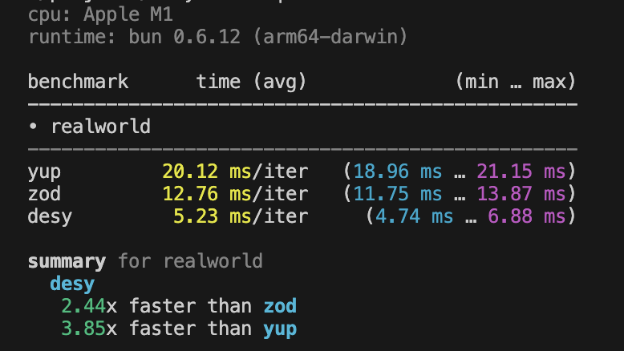

# desy - Dead Extraordinary Simple Yup

benchmark



### From `npm` (Node/Bun)

```sh
npm install desy       # npm
yarn add desy          # yarn
bun add desy           # bun
pnpm add desy          # pnpm
```

**impornat**

- _In valid case desy returns empty string_
- _On error desy returns string with error_

## Basic usage

Creating a simple string schema

```ts
import {d} from 'desy';

// creating a schema for strings
const mySchema = d.string();

// validating
mySchema.validate('tuna'); // => ""
mySchema.validate(12); // => "Value must be string"
```

Creating an object schema

```ts
import {z, InferDesy} from 'desy';

const userSchema = d.object({
  username: d.string(),
});

userSchema.validate({username: 'Ludwig'});

// extract the inferred type
type User = InferDesy<typeof User>;
// { username: string }
```

## Realworld Example

```ts
const schema = d.array(
  d.object({
    type: d.string().oneOf(['person']),
    hair: d.string().oneOf(['blue', 'brown']),
    active: d.boolean(),
    name: d.string(),
    age: d.number().int(),
    hobbies: d.array(d.string()),
    address: d.object({
      street: d.string(),
      zip: d.string(),
      country: d.string(),
    }),
  })
);
schema.validate(people);
```
