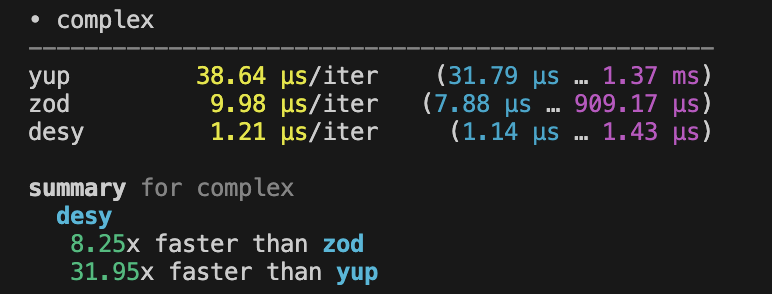

# desy - Dead Extraordinary Simple Yup

## key ideas

- be `simple`
- be as `fast` as point 1 allows

## key features

- Stop validating on the first error. Desy stops validating on the first error and returns it.
- A string is an indicator. Desy returns an empty string in a valid case. In case of an error, Desy returns a string with a description of the error.
- No throwing errors. Desy only returns an empty or non-empty string.

## install

```sh
npm install desy       # npm
yarn add desy          # yarn
bun add desy           # bun
pnpm add desy          # pnpm
```

## Basic usage

Creating a simple string schema

```ts
import {d} from 'desy';

// creating a schema for strings
const mySchema = d.string();

// validating
mySchema.validate('tuna'); // => ""
mySchema.validate(12); // => "Value must be string"
```

Creating an object schema

```ts
import {d, InferDesy} from 'desy';

const userSchema = d.object({
  username: d.string(),
});

userSchema.validate({username: 'Ludwig'});

// extract the inferred type
type User = InferDesy<typeof user>;
// { username: string }
```

## Realworld Example

```ts
const schema = d.array(
  d.object({
    type: d.string().oneOf(['person']),
    hair: d.string().oneOf(['blue', 'brown']),
    active: d.boolean(),
    name: d.string(),
    age: d.number().int(),
    hobbies: d.array(d.string()),
    address: d.object({
      street: d.string(),
      zip: d.string(),
      country: d.string(),
    }),
  })
);
schema.validate(people);
```

## benchmark

[Object benchmark](./bench/object.ts)


[Complex benchmark](./bench/complex.ts)

